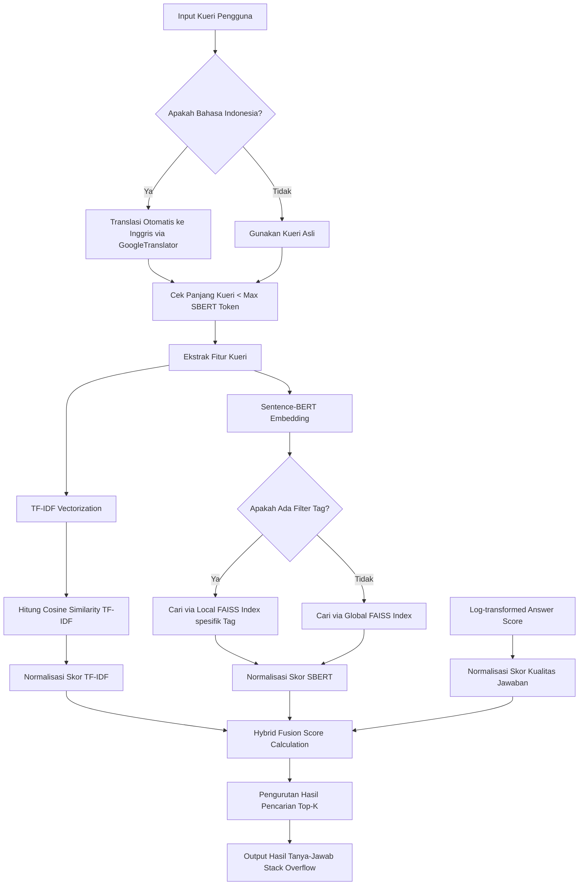

# Stack Overflow Q&A Search Engine: Hybrid Semantic-Lexical Search dengan Query Translation

Proyek Akhir | Mata Kuliah: **Machine Learning**  
Program Studi Teknik Informatika, **UIN Sunan Gunung Djati Bandung**

---

## 📌 Deskripsi Proyek
Proyek ini mengimplementasikan **Mesin Pencari (Search Engine) Tanya-Jawab (Q&A) Stack Overflow** berbasis kecerdasan buatan. Sistem ini menggabungkan pencarian berbasis kata kunci eksak (**Lexical Search via TF-IDF**) dengan pencarian berbasis makna konteks (**Semantic Search via Sentence-BERT**) untuk memberikan hasil pencarian yang sangat relevan dan presisi.

Selain itu, sistem ini dilengkapi dengan **penerjemah otomatis** terintegrasi menggunakan Google Translate API, memungkinkan pengguna mencari solusi pemrograman menggunakan **Bahasa Indonesia**, yang kemudian diterjemahkan ke Bahasa Inggris secara otomatis sebelum diproses oleh mesin pencari Stack Overflow (yang datanya secara default berbahasa Inggris).

---

## 🚀 Fitur Utama

1. **Pencarian Hybrid (Lexical + Semantic)**
   - **Lexical Search (TF-IDF)**: Menggunakan `TfidfVectorizer` dengan rentang *n-gram* (1, 2) untuk mencocokkan kata kunci pemrograman yang spesifik (seperti nama fungsi, nama *library*, atau kode error).
   - **Semantic Search (SBERT)**: Menggunakan model *state-of-the-art* `SentenceTransformer('all-MiniLM-L6-v2')` untuk memahami arti semantik di balik kueri pengguna meskipun kata kunci eksaknya berbeda.

2. **Akselerasi Pencarian dengan FAISS Indexing**
   - **Global FAISS Index**: Memetakan seluruh embedding dataset (33.628 baris) menggunakan `faiss.IndexFlatIP` untuk pencarian kemiripan kosinus (*cosine similarity*) berkecepatan tinggi.
   - **Local Per-Tag Index**: Membuat indeks FAISS mini yang dikhususkan untuk bahasa pemrograman dengan jumlah data sedikit (< 500 baris) guna meningkatkan akurasi pencarian spesifik bahasa pemrograman tertentu.

3. **Multilingual Query Support**
   - Mendukung input pencarian dalam Bahasa Indonesia. Query otomatis diterjemahkan menggunakan `deep-translator` sebelum dimasukkan ke model pencarian.

4. **Community Score Prioritization**
   - Mengintegrasikan metrik kualitas sosial (`AnswerScore` dari Stack Overflow) dengan transformasi logaritmik ($\log(1 + x)$). Ini memastikan jawaban yang telah divalidasi dan disukai oleh komunitas mendapat prioritas lebih tinggi pada urutan hasil pencarian.

5. **Optimasi Kinerja**
   - **Caching (`lru_cache`)**: Menyimpan hasil representasi vektor query untuk menghindari perhitungan ulang (*re-computation*) pada pencarian yang sama.
   - **Query Length Check**: Mengamankan input panjang agar tidak melebihi kapasitas token Sentence-BERT (256 token).

---

## 🏗️ Arsitektur Sistem

Berikut adalah alur bagaimana sistem memproses kueri pencarian dari pengguna hingga mengembalikan hasil pencarian terbaik:



---

## 📊 Detail Perhitungan Skor Hybrid (Fusion)

Skor akhir pencarian dihitung dengan melakukan fusi linear dari tiga komponen skor yang ternormalisasi:

$$\text{Fusion Score} = \alpha \times \text{Skor TF-IDF} + \beta \times \text{Skor SBERT} + \gamma \times \text{Skor Kualitas Jawaban}$$

*   **$\alpha$ (Bobot TF-IDF) = 0.4**: Menjaga kecocokan kata kunci eksak (seperti nama fungsi `pd.read_csv`, `mysql`).
*   **$\beta$ (Bobot SBERT) = 0.5**: Memberikan fokus utama pada kesamaan makna konseptual query.
*   **$\gamma$ (Bobot AnswerScore) = 0.1**: Memberikan dorongan (*boost*) kecil pada jawaban bermutu tinggi berdasarkan penilaian komunitas Stack Overflow.

---

## 📁 Struktur Direktori

```text
├── Dataset/
│   ├── dataset.csv            # Dataset mentah Stack Overflow (Diabaikan oleh Git)
│   └── dataset_clean.csv      # Dataset bersih hasil pra-pemrosesan (Diabaikan oleh Git)
├── Model/
│   ├── Model Fix.ipynb        # Jupyter Notebook utama (pelatihan & evaluasi)
├── README.md                  # Dokumentasi proyek (File ini)
└── requirements.txt           # Daftar dependensi Python
```

---

## 🛠️ Instalasi & Cara Penggunaan

### 1. Prasyarat
Pastikan Anda telah menginstal Python versi 3.8 atau yang lebih baru pada komputer Anda.

### 2. Kloning Repositori
```bash
git clone https://github.com/username/Project-Akhir-Machine-Learning.git
cd Project-Akhir-Machine-Learning
```

### 3. Instalasi Dependensi
Instal pustaka Python yang diperlukan dengan menjalankan perintah berikut:
```bash
pip install -r requirements.txt
```

### 4. Persiapan Dataset
1. Unduh dataset Stack Overflow Q&A (format `.csv`).
2. Buat direktori bernama `Dataset` di direktori utama proyek.
3. Pindahkan file dataset Anda ke dalam folder tersebut dan beri nama `dataset.csv`.

### 5. Menjalankan Notebook
Jalankan Jupyter Notebook dan buka file di dalam direktori `Model`:
```bash
jupyter notebook
```
Buka berkas `Model/Model Fix.ipynb` dan jalankan semua cell untuk memuat dataset, melatih model TF-IDF, menghitung embedding SBERT, membangun indeks FAISS, dan menguji fungsi pencarian.

---

## 📈 Evaluasi Model

Evaluasi model dilakukan secara kuantitatif dengan menguji performa pencarian menggunakan **Keyword Hit Rate @5** (apakah kata kunci yang diharapkan muncul dalam top 5 dokumen hasil pencarian).

Hasil pengujian terhadap query evaluasi standar:

| No | Kueri Uji (Query) | Tag Filter | Expected Keywords | Hasil Terbaik (Top Result) | Status (@5) |
|---|---|---|---|---|---|
| 1 | *how to connect python to mysql database* | python | `mysql`, `connect`, `pymysql` | **Python 3.3 Mysql Connector** | **HIT** (100%) |
| 2 | *difference between machine code and assembly* | assembly | `assembly`, `machine`, `code` | **Assembly code vs Machine code vs Object code?** | **HIT** (100%) |
| 3 | *how to sort array in javascript* | javascript | `sort`, `array`, `javascript` | **How do I empty an array in JavaScript?** | **HIT** (100%) |
| 4 | *null pointer exception java* | java | `null`, `pointer`, `exception` | **Is Catching a Null Pointer Exception a Code Smell?** | **HIT** (100%) |
| 5 | *how to read file in python* | python | `file`, `open`, `read`, `with` | **Reading entire file in Python** | **HIT** (100%) |

**Ringkasan Performa Akhir:**
*   **Keyword Hit Rate @5**: **100.00%** (5/5 kueri pengujian berhasil menemukan kata kunci kunci).
*   **Average Fusion Score**: **0.9345** (menunjukkan tingkat kepercayaan dan relevansi yang sangat tinggi antara kueri dengan hasil yang didapatkan).

---

## 👥 Kontributor
*   **Sarah Ny** (NIM/UIN Sunan Gunung Djati Bandung) - *Developer Utama & Machine Learning Engineer*
